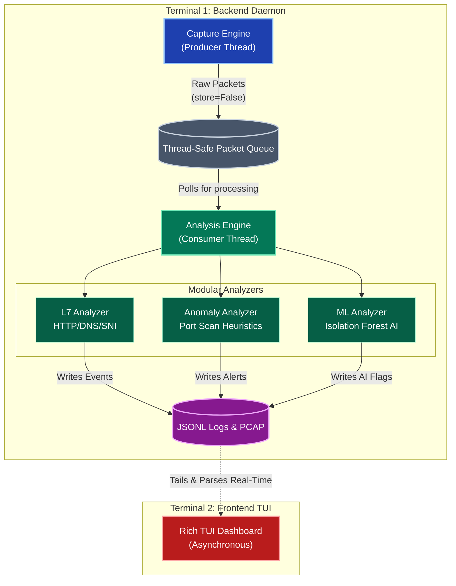

# Packet Dive
**Advanced Python-Based Network Detection & Response (NDR) Engine**

[](https://www.python.org/downloads/)
[](https://scapy.net/)
[](https://scikit-learn.org/)
[](https://opensource.org/licenses/MIT)

**Packet Dive** is a lightweight, high-performance Network Detection and Response (NDR) prototype. Inspired by enterprise platforms like Darktrace and Corelight, it leverages deep packet inspection (DPI), heuristic signatures, and unsupervised Machine Learning to monitor, analyze, and flag anomalous network behavior in real-time.

🔗 **Repository:** [https://github.com/skgpt254/PacketDive.git](https://github.com/skgpt254/PacketDive.git)

---

## Core Features

* **Live & Offline Modes:** Sniff traffic directly from your NIC or ingest massive offline `.pcap` files using memory-efficient generators.
* **AI Anomaly Detection:** Utilizes Scikit-Learn's `IsolationForest` to dynamically cluster network behavior and identify statistically anomalous traffic spikes (e.g., data exfiltration) without requiring pre-labeled data.
* **Heuristic Threat Hunting:** Detects aggressive reconnaissance techniques like rapid multi-port scanning using sliding time-windows.
* **Layer 7 DPI:** Extracts metadata from unencrypted HTTP, decodes DNS queries, and parses Server Name Indications (SNI) from TLS/HTTPS Client Hello handshakes.
* **Decoupled TUI Dashboard:** A stunning, asynchronous split-screen Terminal User Interface built with `rich`, separating the heavy packet-processing engine from the visualization layer.

---

## Architecture & Logic

Packet Dive is built on a **Producer-Consumer architecture** to prevent dropped packets and memory exhaustion during high-throughput analysis.


### 1. The Capture Engine (Producer)
Runs on a dedicated daemon thread. It uses kernel-level BPF (Berkeley Packet Filter) to strip out noise (like ARP/STP) before passing raw bytes to Scapy. Crucially, Scapy's `store=False` flag is utilized to prevent RAM exhaustion. Captured packets are pushed into a thread-safe queue.

### 2. The Analysis Engine (Consumer)
Pulls packets from the queue and distributes them across three primary modules:
* **L7 Analyzer:** Parses application-layer payloads.
* **Anomaly Analyzer:** Maintains a stateful, sliding time-window of connection attempts per IP to detect port scanning.
* **ML Analyzer:** Extracts feature vectors (packet count, total bytes) per IP. Every `N` seconds, it feeds these vectors into an Isolation Forest algorithm.

### 3. The Isolation Forest Logic

Instead of defining what "bad" traffic looks like, the ML model randomly partitions the traffic data. Because anomalies (like a sudden 5GB data transfer) are rare and statistically distant from normal web browsing, they require fewer algorithmic "splits" to isolate. If an IP yields an anomaly score of `-1`, the system fires a high-priority alert.

---

## Installation & Setup

**1. Clone the repository:**
```bash
git clone https://github.com/skgpt254/PacketDive.git
cd PacketDive

```

**2. Install dependencies:**
It is recommended to use a virtual environment.

```bash
pip install scapy scikit-learn pandas rich

```

**3. Configure your interface:**
Open `config.py` and ensure the settings match your environment.

```python
INTERFACE = None  # Set to "eth0", "wlan0", or "Ethernet" if auto-detect fails
BPF_FILTER = "ip" 
ML_CONTAMINATION = 0.01 # Tuning for AI sensitivity

```

---

## Usage (Execution Flow)

Packet Dive requires **two separate terminal instances** to run effectively—one for the backend engine and one for the frontend dashboard.

### Terminal 1: Start the Backend Engine

*Note: Packet sniffing requires elevated privileges.*

```bash
# Linux/macOS
sudo python3 main.py

# Windows (Run Command Prompt as Administrator)
python main.py

```

*(Optional) To run an offline PCAP analysis instead of live capture:*

```bash
sudo python3 main.py --read path/to/your/capture.pcap

```

### Terminal 2: Start the Dashboard

Once the engine is running and writing logs, launch the TUI in a standard (non-admin) terminal:

```bash
python -m ui.dashboard

```

---

## Troubleshooting & Common Errors

| Error / Issue | Cause | Resolution |
| --- | --- | --- |
| **`PermissionError: Operation not permitted`** | The script lacks socket-binding privileges. | Run `main.py` with `sudo` (Linux/Mac) or as an Administrator (Windows). |
| **Spam of `Unknown cipher suite` Warnings** | Scapy is complaining about modern TLS 1.3 GREASE ciphers sent by your browser. | Packet Dive silences this internally via `logging.getLogger("scapy.runtime").setLevel(logging.ERROR)` in `main.py`. Ensure this line remains at the top of the file. |
| **No Packets Showing in Dashboard** | Scapy selected the wrong default network interface. | Edit `config.py` and manually set `INTERFACE` to your active adapter (e.g., `INTERFACE = "wlan0"`). |
| **"AI Alert" Fatigue (Too many red alerts)** | The Isolation Forest model is too sensitive or analyzing local heavy-hitters (like media servers). | Open `config.py` and lower `ML_CONTAMINATION` to `0.005`. Open `core/ml_analyzer.py` and whitelist your local IPs or increase the minimum packet threshold. |
| **`ModuleNotFoundError` on Dashboard** | You are running the script from inside the `ui` folder. | Always execute `python -m ui.dashboard` from the root `PacketDive` directory. |

---

## 📂 Project Structure

```text
PacketDive/
├── core/                   # Core mechanics and packet processing
│   ├── __init__.py
│   ├── capture.py          # Multithreaded Scapy sniffer
│   ├── analysis.py         # L7 & Heuristic orchestrator
│   ├── storage.py          # PCAP writer
│   ├── pcap_parser.py      # Offline generator-based PCAP reader
│   └── ml_analyzer.py      # Scikit-Learn Isolation Forest implementation
├── ui/                     # Visualization layer
│   ├── __init__.py
│   └── dashboard.py        # Rich-based Terminal User Interface
├── logs/                   # Auto-generated JSONL logs and PCAP dumps
├── config.py               # Global tunable parameters
└── main.py                 # Application entry point and CLI args

```

---

## Contributing

Contributions are welcome! If you want to add new Machine Learning models (like K-Means clustering), new protocol decoders (like SMB or FTP), or UI enhancements, feel free to open a Pull Request.

## License

This project is licensed under the MIT License - see the LICENSE file for details.
